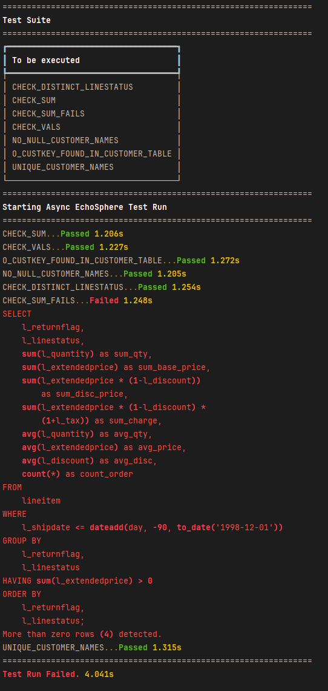

<div align="center">
  <a href="https://mauricekuenicke.github.io/EchoSphere/"></a>

  <h3>Modern SQL Testing</h3>

  <a href="https://github.com/MauriceKuenicke/EchoSphere/actions/workflows/deploy_docs.yaml">
    
  </a>
  <a href="https://github.com/MauriceKuenicke/EchoSphere/releases">
    </a>
  <a href="https://www.python.org/downloads/release/python-3100/">
    </a>

  <p>
    <a href="https://mauricekuenicke.github.io/EchoSphere/">Documentation</a>
    ·
    <a href="https://mauricekuenicke.github.io/EchoSphere/getting-started/">Get Started</a>
    ·
    <a href="https://mauricekuenicke.github.io/EchoSphere/examples/cookbook/">Examples</a>
    ·
    <a href="https://github.com/MauriceKuenicke/EchoSphere/issues">Issues</a>
  </p>
</div>

---

## ✨ Overview
EchoSphere helps you write and run maintainable, SQL-first tests against your Snowflake data warehouse. Catch data issues early, build confidence in your pipelines, and run checks at scale without leaving SQL.

> Snowflake focus today. Engine-agnostic design enables future database support.

## 🚀 Key Features
- Fast, parallel test execution across environments
- Lightweight test authoring using plain SQL files (.es.sql)
- Zero-rows-as-success contract for simple, powerful assertions
- CI/CD friendly output and exports (e.g., JUnit/XML, Excel)
- Clear environment isolation and switching per run
- Built for teams: structure, conventions, and reporting

## 📦 Quick Start

### Installation
```sh
pip install "EchoSphere[snowflake,postgres] @ git+https://github.com/MauriceKuenicke/EchoSphere.git"
```

### First-time setup
```sh
es setup
```
This creates a default location for your SQL tests and a configuration file with Snowflake credentials and environments.

### Write your first test
Create a file like tests/my_first_test.es.sql:
```sql
-- Expect 0 rows when the rule holds
SELECT *
FROM (
  SELECT SUM(O_TOTALPRICE) AS "SUM_TOTALPRICE"
  FROM ORDERS
  WHERE O_ORDERDATE = '1995-02-19'
)
WHERE "SUM_TOTALPRICE" <> 944870465.07;
```
If the values don't match, the query returns a row and the test fails; if it returns zero rows, the test passes.

### Run tests
```sh
# Run with default env
es run

# Run against a specific env
es run -e env.snowflake.dev
```

# Run with exports
```
es run --junitxml=test_result.xml --export-failures=failures.xlsx
```

<p align="center">
  
</p>

## 📚 Documentation
- Getting Started: https://mauricekuenicke.github.io/EchoSphere/getting-started/
- User Guide: https://mauricekuenicke.github.io/EchoSphere/user-guide/
- Command Reference: https://mauricekuenicke.github.io/EchoSphere/command-reference/
- Reference (Configuration, SQL syntax, API): https://mauricekuenicke.github.io/EchoSphere/reference/
- Examples & Tutorials: https://mauricekuenicke.github.io/EchoSphere/examples/cookbook/
- Contributing: https://mauricekuenicke.github.io/EchoSphere/contributing/

## 🤝 Community & Support
- Issues & Feature Requests: https://github.com/MauriceKuenicke/EchoSphere/issues
- Source Code: https://github.com/MauriceKuenicke/EchoSphere

## ⚠️ Important
This project is early-stage and not recommended for production use yet. Proceed at your own risk.

## 🧭 Environment Management
Manage multiple Snowflake environments in es.ini:
```ini
[default]
env = env.snowflake.dev

[env.snowflake.dev]
user = ...
password = ...
account = ...
warehouse = ...
role = ...
database = ...
schema = ...
```
Switch env at runtime:
```sh
es run -e env.snowflake.dev
```

<details>
  <summary>About the name</summary>
  <em>Derived from the mythological nymph Echo — cursed to repeat the words of others — the name symbolizes reflection and reverberation. Echo's voice lingered in caves and valleys, mirroring sounds across vast expanses.</em>
</details>

## List of Databases to be added in the future
- [ ] Amazon Redshift
- [ ] Google BigQuery
- [ ] Firebolt
- [ ] Azure Synapse
- [ ] Microsoft SQL Server

## 📄 License
No explicit license file is present in this repository at the moment. Please refer to the repository owner for licensing details.

---

### Development
```sh
pip install -e .[dev]
```
