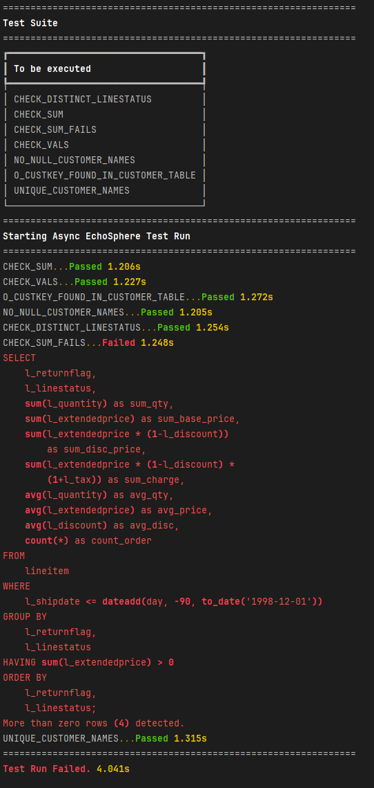

<div align="center">
  <a href="https://mauricekuenicke.github.io/EchoSphere/"></a>

  <h3>pytest for databases</h3>
  <p><strong>Test your database like you test your code.</strong></p>

  <a href="https://github.com/MauriceKuenicke/EchoSphere/actions/workflows/deploy_docs.yaml">
    
  </a>
  <a href="https://github.com/MauriceKuenicke/EchoSphere/releases">
    </a>
  <a href="https://www.python.org/downloads/release/python-3100/">
    </a>

  <p>
    <a href="https://mauricekuenicke.github.io/EchoSphere/">Documentation</a>
    ·
    <a href="https://mauricekuenicke.github.io/EchoSphere/getting-started/">Get Started</a>
    ·
    <a href="https://mauricekuenicke.github.io/EchoSphere/why-echosphere/vs-soda/">EchoSphere vs Soda</a>
    ·
    <a href="https://mauricekuenicke.github.io/EchoSphere/why-echosphere/ai-era/">AI Era Approach</a>
    ·
    <a href="https://mauricekuenicke.github.io/EchoSphere/examples/cookbook/">Examples</a>
    ·
    <a href="https://github.com/MauriceKuenicke/EchoSphere/issues">Issues</a>
  </p>
</div>

---

## EchoSphere = pytest for databases
EchoSphere is a SQL-first CLI test framework for databases and data warehouses.
You keep tests in Git, run them in CI, and get failure output as rows directly from the query.

## Core message
> Test your database like you test your code.

Without DSL. Without Cloud. Without onboarding processes.

## Why teams choose EchoSphere
- No DSL: write tests as plain `.es.sql` files.
- No cloud dependency: run locally and in CI with `es`.
- No onboarding ceremony: `es init`, write tests, run tests.
- Developer-native workflow: PR review, tags, CI gate, repeat.
- Deterministic pass/fail model: zero rows = pass.

## EchoSphere vs Soda (short version)
> Soda: "Define what good data looks like."  
> EchoSphere: "Test your database like you test your code."

| Category | Soda (typical positioning) | EchoSphere |
| --- | --- | --- |
| Abstraction | Checks/policies + SQL options | Plain SQL tests (`.es.sql`) |
| Workflow center | Platform/onboarding oriented | Git + CLI + CI |
| Execution style | Workspace/process driven | Local-first + pipeline-native |
| Failure signal | Check-level status | Failing rows from SQL |

Read the full comparison: https://mauricekuenicke.github.io/EchoSphere/why-echosphere/vs-soda/

## Supported connectors
<p style="margin-top: 0.5rem;">
  
  &nbsp;&nbsp;
  
  &nbsp;&nbsp;
  
  &nbsp;&nbsp;
  
</p>

## Quick start

### Installation
```sh
pip install "EchoSphere[snowflake,postgres] @ git+https://github.com/MauriceKuenicke/EchoSphere.git"
```

### First setup
```sh
es init --platform sqlite
# or local guided starter:
es init --platform tutorial
```
This scaffolds `es_suite/` and `es.ini`.
`tutorial` also creates and seeds a local SQLite DB.

### Write your first test
Create `es_suite/my_first_test.es.sql`:
```sql
-- @name: Orders Total Validation
-- @tag: critical, nightly
SELECT *
FROM (
  SELECT SUM(O_TOTALPRICE) AS "SUM_TOTALPRICE"
  FROM ORDERS
  WHERE O_ORDERDATE = '1995-02-19'
)
WHERE "SUM_TOTALPRICE" <> 944870465.07;
```
If this query returns rows, the test fails. Zero rows means pass.

### Run tests
```sh
# default environment
es run

# target environment
es run -e env.snowflake.dev

# tag filtering
es run --tag critical
es run --tag nightly --exclude-tag slow
```

Run with exports:
```sh
es run --junitxml test_result.xml --export-failures failures.xlsx
```

Inspect test inventory or SQL:
```sh
es view tests --all
es view test my_first_test
```

<p align="center">
  
</p>

## Community & support
- Issues & Feature Requests: https://github.com/MauriceKuenicke/EchoSphere/issues
- Source Code: https://github.com/MauriceKuenicke/EchoSphere

## Important
This project is early-stage. Proceed at your own risk.

## Environment management
Manage multiple Snowflake environments in es.ini:
```ini
[default]
env = env.snowflake.dev

[env.snowflake.dev]
user = ...
password = ...
account = ...
warehouse = ...
role = ...
database = ...
schema = ...
```
Switch env at runtime:
```sh
es run -e env.snowflake.dev
```

## Planned connectors
- [ ] Amazon Redshift
- [ ] Google BigQuery
- [ ] Firebolt
- [ ] Azure Synapse
- [ ] Microsoft SQL Server

### Development
```sh
pip install -e .[dev]
```
